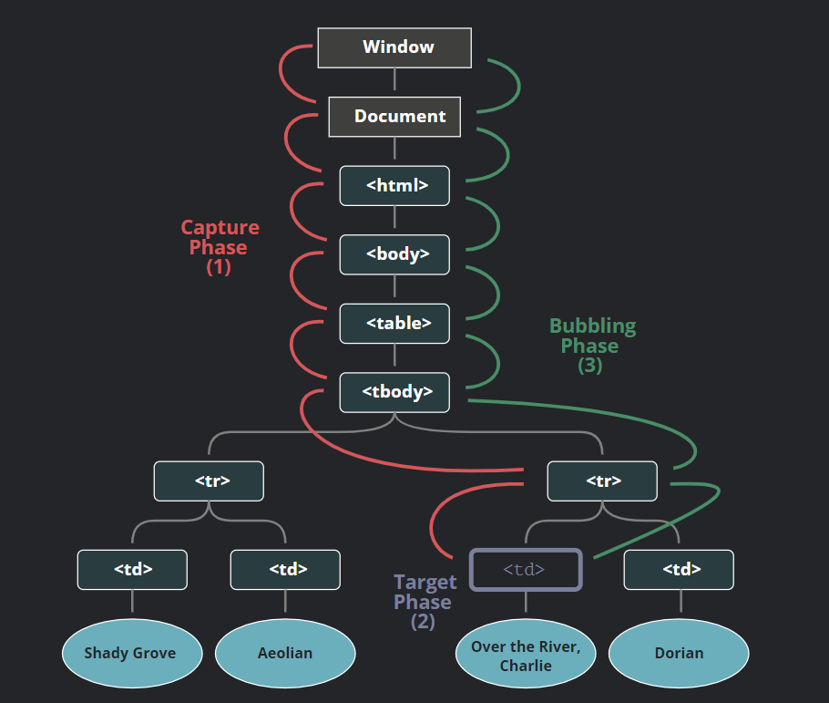

# Eventos en JavaScript
  ***Eduardo Jared Aguirre Cárdenas | 19100140***
## ¿Qué son?
Son la manera en que podemos monitorear los sucesos de la pagina web y el comportamiento de los usuarios. Por ejemplo: Cuando un usuario hace click.
### ¿Como capturar uno?
Se hace la siguiente estructura

```el.addEventListener(event, () => {})```

Donde el *evento* sera de tipo *click*
``` 
const el = document.getElementById('mi_boton')
el.addEventListener('click', () => {
  console.log('elemento clicado!')
})
```


## Bubbling

Cuando un evento pasa en un elemnto, primero corre el que maneja en el, luego al de su padre, y asi sucecivamente hacia el ancestro siguiente.

``` 
<style>
  body * {
    margin: 10px;
    border: 1px solid blue;
  }
</style>

<form onclick="alert('form')">FORM
  <div onclick="alert('div')">DIV
    <p onclick="alert('p')">P</p>
  </div>
</form>
```

Donde observa que: primero corre en el evento ```onclick``` de ```<p>```.

1. Primero pasa por ```<p>```

2. Luego afuera por el ```<div>```

3. Y hacia afuera por el ```<form>```
   
4.  Y despues al documento

## Capturing
Luego hay otra fase del evento llamado "capturing". Que tiene 3 fases de propagacion:

1. **Fase de captura:** El evento va hacia abajo del elemento (Osease hijos)
2. **Fase objetivo:** El evento alcanza el objetivo
3. **Fase de bubbling:** El evento burbujea hacia arriba del elemento.



Para capturar el evento necesitamos usar el manejador (handler) : ```capture``` a la opcion ```true```:
```
elem.addEventListener(..., {capture: true})
// o, solamente "true" como un alias {capture: true}
elem.addEventListener(..., true)
```

Al final usando esto:
```
<style>
  body * {
    margin: 10px;
    border: 1px solid blue;
  }
</style>

<form>FORM
  <div>DIV
    <p>P</p>
  </div>
</form>

<script>
  for(let elem of document.querySelectorAll('*')) {
    elem.addEventListener("click", e => alert(`Capturing: ${elem.tagName}`), true);
    elem.addEventListener("click", e => alert(`Bubbling: ${elem.tagName}`));
  }
</script>
```